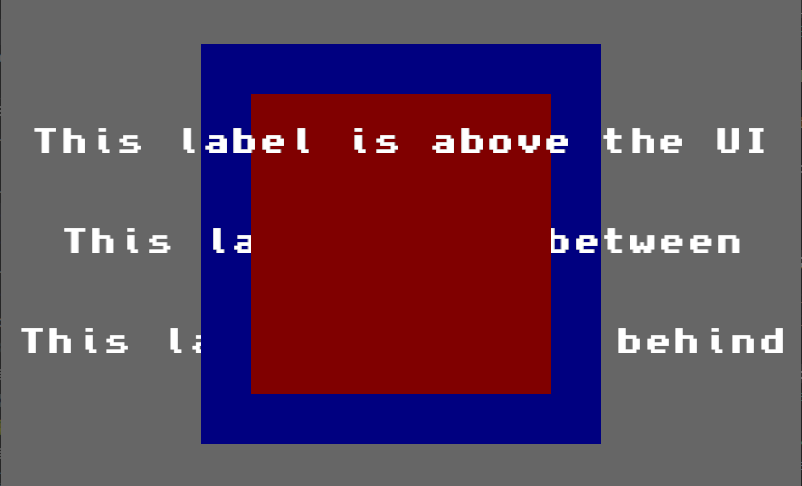
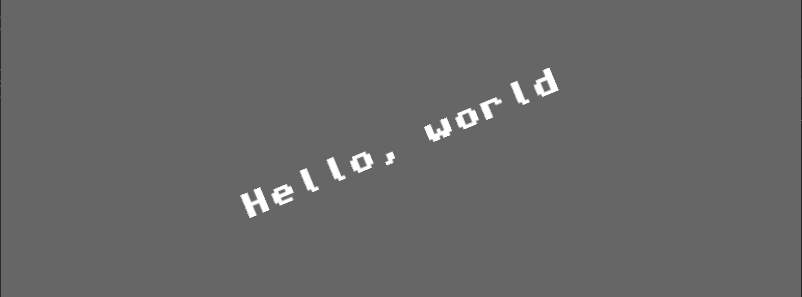

# bevy_mod_ui_independent_text
[](https://crates.io/crates/bevy_mod_ui_independent_text)
[](https://github.com/ickshonpe/bevy_mod_ui_independent_text)
[](https://crates.io/crates/bevy_mod_ui_independent_text)

Bevy UI text with a transform independent of the UI's layout. 
* Draw text at any Z depth, above or below Bevy UI elements
* Text can be rotated and scaled
* Customisable alignment and bounds
* Supports Bevy 0.8



## Usage

Add the dependency to `Cargo.toml`:

```toml
bevy_mod_ui_independent_text = "0.3.0"
```

Add the plugin to your Bevy app:

```rust
use bevy_mod_ui_independent_text::*;

fn main() {
    App::new()
        .add_plugins(DefaultPlugins)
        .add_plugin(IndependentTextPlugin)
        // ..rest of app
        .run()
}
```

Don't forget a camera:

```rust
commands.spawn_bundle(Camera2dBundle::default());
```

Then you can draw text by spawning a IndependentTextBundle:

```rust
 commands.spawn_bundle(IndependentTextBundle {
        text: UiText(Text {
            sections: vec![TextSection {
                value: "Hello, world".to_string(), 
                style: TextStyle {
                    font: asset_loader.load("Topaz-8.ttf"),
                    font_size: 32.0,
                    color: Color::WHITE
                },
            }],
            alignment: TextAlignment::CENTER,
        }),
        transform: Transform {
            translation: Vec3::new(400., 300., 100.),
            rotation: Quat::from_rotation_z(std::f32::consts::PI / 8.),
            ..Default::default()
        },
       ..Default::default()
    });
```



## Examples

```
cargo --run --example hello_world
cargo --run --example depth
cargo --run --example bounded
```